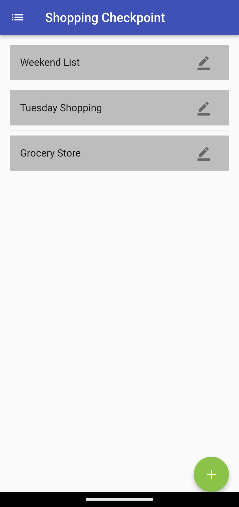
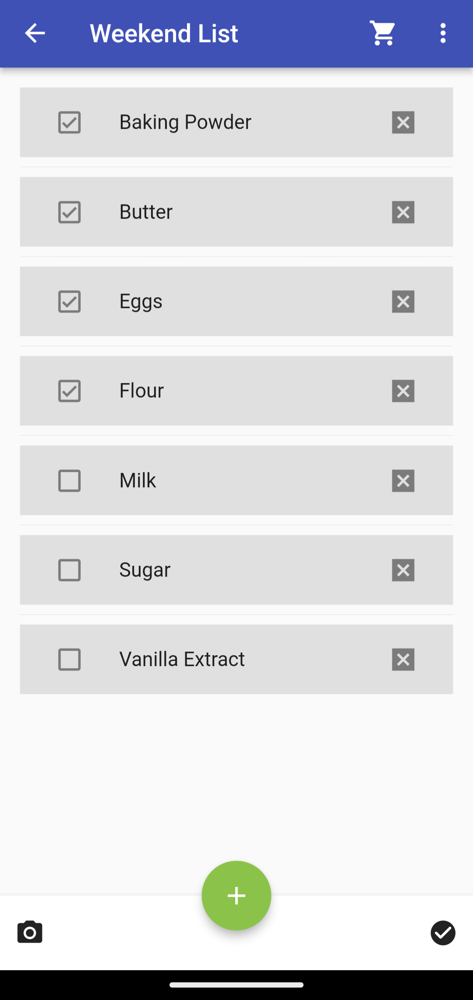
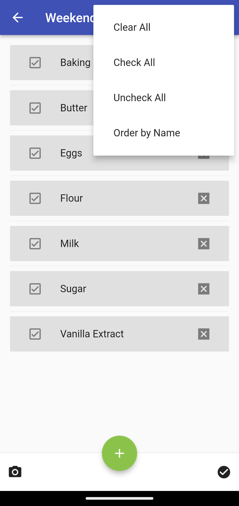
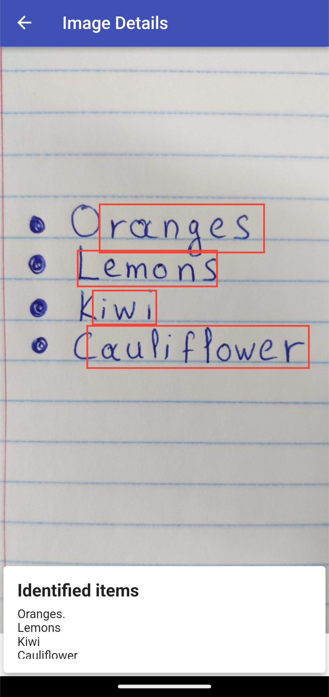

# Shopping Checkpoint

A simple shopping list application written in Dart with the Flutter SDK. This app was created by [@PanagiotisPapadeas](https://github.com/PanagiotisPapadeas) and [@mvlassis](https://github.com/mvlassis) as part of the 2021-2022 course in Human-Computer Interaction from the National Technical University of Athens (NTUA). 

## Features
- Create shopping lists and populate them with items
- Check/Uncheck items to your heart's content
- Sort all items and check whether there are any items remaining
- Add items from a written list using optical character recognition (OCR)
- Cross-platform compatiblity provided by Flutter. We mainly targeted Android as well as web browsers.

## Gallery
   

## Tools used
- Flutter SDK
- Android Studio
- Figma (to create the app prototype)
